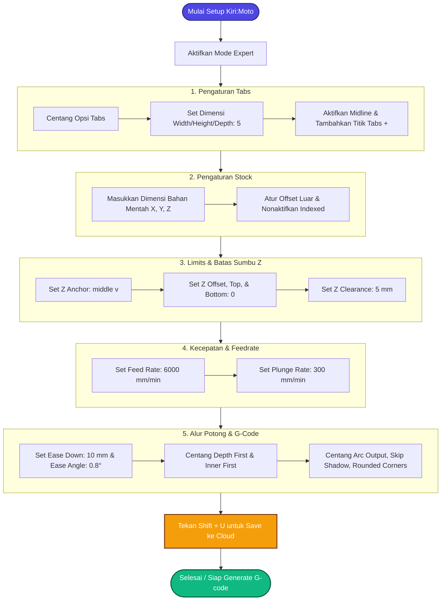

# 🛠️ Kiri:Moto CNC Milling Cheatsheet & Parameter Reference

Dokumen ini berisi rangkuman fungsi, parameter default, dan penjelasan logis untuk konfigurasi **CNC Milling** pada *slicer* browser Kiri:Moto.

---

## 1. Tabs (Pengikat Benda Kerja)
*Tabs* adalah jembatan kecil material yang sengaja ditinggalkan agar benda kerja tidak terlepas, bergeser, atau terlempar saat pemotongan tembus (*cutout*) selesai.

*   **Width (5):** Lebar horizontal struktur tab (5 mm).
*   **Height (5):** Ketinggian/ketebalan vertikal struktur tab (5 mm).
*   **Depth (5):** Kedalaman penetrasi tab masuk ke dalam model (5 mm).
*   **Midline:** Posisi tab otomatis diletakkan tepat di tengah-tengah ketebalan model.
*   **+ (Add Button):** Tombol interaktif untuk menempatkan titik tab baru secara manual pada model 3D.

---

## 2. Stock (Bahan Baku / Blok Material)
Konfigurasi dimensi fisik material mentah sebelum dipotong oleh pahat.

*   **Width (5):** Ukuran total material pada Sumbu X (5 mm).
*   **Depth (5):** Ukuran total material pada Sumbu Y (5 mm).
*   **Height (1):** Ketebalan total material pada Sumbu Z (1 mm).
*   **Offset:** Jarak tambahan (margin) di sekeliling luar model untuk memastikan pembersihan material optimal.
*   **Indexed:** Mode pengerjaan multi-sisi berputar (*4-axis rotary* atau *flip-milling*).

---

## 3. Limits & Z-Axis (Batas Aman Sumbu Z)
Pengaturan koordinat vertikal untuk menjaga keamanan mesin, pahat, dan *clamp* penahan.

*   **Z Anchor (middle v):** Titik acuan sumbu Z, diatur di tengah (*middle*) secara vertikal pada material.
*   **Z Offset (0):** Nilai pergeseran sumbu Z dari titik jangkar (0 mm = tanpa pergeseran).
*   **Z Top (0):** Posisi koordinat permukaan paling atas dari material mentah.
*   **Z Bottom (0):** Batas kedalaman maksimum yang diizinkan untuk dipotong oleh pahat.
*   **Z Clearance (5):** Ketinggian aman (5 mm) di atas benda kerja. Pahat akan naik ke titik ini saat melakukan pergerakan cepat (*rapid travel*) melintasi area kosong agar tidak menabrak material/klem.

---

## 4. Feed & Speed (Kecepatan Gerak Pahat)
Parameter kontrol waktu pengerjaan dan kualitas potong mesin.

*   **Feed Rate (6000):** Kecepatan potong horizontal (Sumbu X/Y) saat memotong material (6000 mm/menit).
*   **Plunge Rate (300):** Kecepatan tusuk vertikal (Sumbu Z) saat pahat pertama kali masuk ke dalam material (300 mm/menit).

---

## 5. Output & Strategi Pemotongan
Menentukan urutan prioritas gerakan pemotongan dan generasi perintah G-code.

*   **Ease Down (10):** Jalur masuk miring (*ramping*) sepanjang 10 mm untuk memotong secara bertahap, meminimalkan stres beban langsung pada ujung pahat.
*   **Depth First:** Pahat akan menyelesaikan satu profil lubang/kantong hingga kedalaman penuh sebelum berpindah ke profil berikutnya. (Jika mati, pemotongan dilakukan lapis demi lapis merata ke seluruh model).
*   **Inner First:** Memotong fitur bagian dalam (seperti lubang/slot) terlebih dahulu sebelum memotong profil luar benda kerja untuk mencegah hilangnya rigiditas bahan.
*   **Tool Init:** Blok kode perintah perintah awal (*setup macro*) untuk inisialisasi pahat atau sistem spindel.

---

## 6. Advanced Z Controls
*   **First Z Max:** Memaksa kedalaman pemotongan lapisan pertama (*first pass*) langsung berada pada batas maksimum demi efisiensi.
*   **Force Z Max:** Memaksa sumbu Z untuk selalu naik ke titik clearance tertinggi setiap kali berganti jalur potong baru.

---

## 7. Entry & Engagement (Sudut Penetrasi)
*   **Ease Angle (0.8):** Sudut kemiringan (0.8 derajat) saat pahat masuk bergerak maju ke dalam material (*ramping angle*).
*   **Engage Factor (0):** Koefisien beban atau penyesuaian kecepatan saat pahat pertama kali menyentuh dinding material.

---

## 8. Origin (Titik Nol Mesin / WCS G54)
Menentukan letak titik koordinat awal (0,0,0) sebagai acuan kerja mesin CNC.

*   **Origin Top:** Titik nol sumbu Z diposisikan rata dengan permukaan atas material mentah.
*   **Origin Center:** Titik nol sumbu X dan Y diletakkan tepat di tengah-tengah material mentah.
*   **Offset X (0) / Y (0) / Z (0):** Pergeseran koordinat manual secara spesifik jika titik nol nyata di meja mesin sengaja digeser dari standar perangkat lunak.

---

## 9. Tombol Sistem
*   **Select:** Digunakan untuk memilih model, area kerja, atau tipe pahat (*endmill*).
*   **Reset:** Mengembalikan seluruh konfigurasi parameter ke setelan bawaan pabrik (*factory default*).
*   **Expert:** Mengaktifkan opsi mode tingkat lanjut untuk membuka fungsi-fungsi optimasi tersembunyi.

---

## 10. Fitur Tambahan (Expert Mode)
*   **Arc Output:** Mengaktifkan konversi kode gerakan melingkar sejati (`G2`/`G3`) alih-alih memecah lingkaran menjadi ribuan garis lurus pendek (`G1`). Menghasilkan gerakan mesin yang jauh lebih halus dan ukuran berkas G-code yang jauh lebih kecil.
*   **Skip Shadow:** Mengabaikan kalkulasi pemotongan pada area kosong yang tidak memiliki model kerja untuk menghemat waktu pengerjaan.
*   **Rounded Corners:** Membulatkan sedikit radius sudut tajam pada jalur lintasan agar kecepatan makan mesin (*feed*) konstan dan mengurangi getaran berlebih (*chatter*).

---

## 📑 Panduan Pengaturan Parameter CNC: Tabs, Stock, & Advanced

Untuk membuka seluruh parameter di bawah ini, pastikan Anda telah mengaktifkan tombol **Expert** di panel kanan bawah Kiri:Moto terlebih dahulu.

---

### 🛑 1. Pengaturan Tabs (Jembatan Pengikat)
*Tabs* wajib diatur jika Anda memotong material hingga tembus (*cutout*). Tanpa tabs, benda kerja akan lepas di akhir pemotongan, tersangkut pada pahat yang berputar, dan berisiko merusak model atau mematahkan pahat.

*   **Cara Memasang Tabs:**
    1. Centang atau aktifkan opsi **Tabs**.
    2. Masukkan dimensi standar: **Width: 5**, **Height: 5**, dan **Depth: 5**.
    3. Pilih **Midline** agar posisi jembatan ini berada tepat di tengah-tengah ketebalan material Anda.
    4. Klik tombol **+ (Select/Add)**, lalu klik pada garis luar model di layar 3D untuk menempatkan titik tabs. Berikan minimal 2–4 titik untuk menjaga stabilitas objek.

---

### 📦 2. Pengaturan Stock (Ukuran Bahan Mentah)
Kiri:Moto memerlukan data ukuran balok material mentah asli yang Anda jepit di meja CNC.

*   **Konfigurasi Dimensi:**
    *   **Width (X):** Masukkan lebar total bahan mentah Anda (Contoh: `5` mm atau sesuai ukuran asli kayu/akrilik Anda).
    *   **Depth (Y):** Masukkan kedalaman/panjang bahan mentah (Contoh: `5` mm).
    *   **Height (Z):** Masukkan tebal material mentah Anda (Contoh: `1` mm).
*   **Offset:** Jika bahan mentah Anda sedikit lebih besar dari model digital, berikan nilai offset (misal `2` mm) agar pahat mulai memotong dari luar material dengan aman.
*   **Indexed:** Biarkan tidak dicentang kecuali Anda menggunakan sumbu rotasi ke-4 (*4th axis / rotary table*).

---

### 📐 3. Pengaturan Koordinat & Batas Sumbu Z (Limits)
Bagian terpenting untuk mencegah pahat menabrak meja kerja mesin (*spoilboard*).

*   **Z Anchor:** Pilih **middle v** (*Middle Vertical*) untuk memposisikan titik jangkar di tengah material, atau sesuaikan dengan kebutuhan taktik pengerjaan Anda.
*   **Z Offset:** Atur ke `0` sebagai standar awal.
*   **Z Top & Z Bottom:** Atur ke `0`. Ini adalah titik aman di mana **Z Top** adalah permukaan atas material mentah Anda, dan **Z Bottom** adalah batas bawah terdalam pergerakan pahat.
*   **Z Clearance:** Atur ke `5` mm. Setiap kali pahat selesai memotong satu jalur dan ingin pindah ke jalur lain, pahat akan naik setinggi 5 mm di atas material untuk menghindari klem penahan.

---

### ⚡ 4. Pengaturan Kecepatan (Feed & Plunge)
*   **Feed Rate:** Atur ke `6000` mm/menit. Ini adalah kecepatan gerak potong horizontal (X dan Y). *Catatan: Sesuaikan nilai ini dengan kemampuan mesin Anda. Untuk mesin hobi kecil, Anda mungkin perlu menurunkannya ke 1000–2000 mm/menit.*
*   **Plunge Rate:** Atur ke `300` mm/menit. Ini adalah kecepatan pahat bergerak turun tegak lurus (Sumbu Z) menusuk material. Selalu buat nilai ini jauh lebih kecil dari Feed Rate.

---

### 🔄 5. Alur Pemotongan & Output (Expert Mode)
*   **Ease Down:** Atur ke `10` mm. Fitur ini membuat pahat masuk ke material secara miring (*ramping*) sepanjang 10 mm, bukan langsung menancap tegak lurus, sehingga memperpanjang umur pakai pahat.
*   **Ease Angle:** Masukkan `0.8` derajat untuk sudut kemiringan saat pahat mulai menusuk masuk secara perlahan (*ramping angle*).
*   **Depth First (Rekomendasi - Dicentang):** Pahat akan menyelesaikan satu lubang hingga jebol ke bawah terlebih dahulu, baru pindah ke lubang berikutnya.
*   **Inner First (Rekomendasi - Dicentang):** Pahat akan memotong bagian dalam/lubang-lubang kecil terlebih dahulu. Profil luar model baru akan dipotong di akhir proses agar sisa bahan tetap kokoh terjepit.

---

### 🛠️ 6. Fitur Optimasi G-Code (Expert)
*   **Arc Output (Wajib Dicentang):** Mengaktifkan kode G2/G3 untuk gerakan melingkar sejati. Hasil potongan bulat akan menjadi sangat halus dan ukuran file G-code menjadi sangat kecil.
*   **Skip Shadow (Dicentang):** Mengabaikan kalkulasi pada area kosong yang tidak memiliki model untuk menghemat waktu pengerjaan mesin.
*   **Rounded Corners (Dicentang):** Membulatkan sedikit sudut tajam pada jalur pahat agar mesin tidak mengerem mendadak di sudut siku, yang dapat menyebabkan getaran (*chatter*) pada hasil potongan.

---

### 🪵 & 💎 Rekomendasi Feed/Plunge Rate Berdasarkan Material

Berikut adalah panduan perkiraan kecepatan pemotongan (*Feed Rate* & *Plunge Rate*) untuk beberapa jenis material menggunakan mata pahat standar (misal: *2-flute flat endmill* diameter 3.175 mm atau 1/8" pada mesin CNC hobi/semipro):

| Material | Feed Rate (X/Y) | Plunge Rate (Z) | Depth of Cut (Stepdown) per Pass | Keterangan |
| :--- | :--- | :--- | :--- | :--- |
| **Kayu Lunak (Softwood / MDF / Plywood)** | 1500 - 2500 mm/menit | 300 - 500 mm/menit | 1.0 - 2.0 mm | Mudah dipotong, bersihkan serpihan kayu secara berkala agar tidak macet. |
| **Kayu Keras (Hardwood - Jati/Mahoni)** | 1000 - 1500 mm/menit | 200 - 300 mm/menit | 0.5 - 1.0 mm | Butuh kecepatan lebih lambat dan stepdown lebih tipis agar pahat tidak patah dan serat tidak pecah (*tearout*). |
| **Akrilik (Acrylic / PMMA)** | 800 - 1200 mm/menit | 150 - 250 mm/menit | 0.3 - 0.6 mm | Gunakan mata pahat *single-flute* (O-flute) agar akrilik tidak meleleh dan menggulung pada pahat. |
| **Aluminium (Soft Metal - Seri 6061)** | 400 - 600 mm/menit | 80 - 120 mm/menit | 0.1 - 0.2 mm | Wajib pelumasan (*mist/air blast*) agar aluminium tidak menempel pada mata pahat (*chip welding*). |

*Catatan: Nilai di atas adalah panduan awal. Selalu lakukan tes potong (*test cut*) pada material sisa sebelum memulai proyek utama.*

---

## 🛠️ Jenis Operasi Potong CNC Milling (Kiri:Moto Operations)

Berikut adalah fungsi dari masing-masing jenis operasi potong (tombol kotak-kotak) yang ada pada Kiri:Moto:

### 1. Operasi Potong / Bentuk (Paling Sering Digunakan)
*   **outline:** Memotong mengikuti garis tepi atau dinding dari desain (bisa keliling luar atau lubang dalam). Ini adalah operasi dasar untuk memotong objek.
*   **pocket:** Mengikis material di dalam sebuah area tertutup untuk membuat cekungan atau bak (kantong) dengan kedalaman tertentu tanpa menembusnya.
*   **rough:** Proses pengikisan awal secara kasar untuk membuang material dalam jumlah besar dengan cepat sebelum masuk ke tahap penyelesaian halus (*finishing*).
*   **contour:** Mengikuti lekukan permukaan 3D naik-turun secara halus, biasanya digunakan untuk *finishing* permukaan yang melengkung atau tidak rata.
*   **trace:** Memotong mengikuti sebuah garis tunggal atau garis gambar 2D (*engraving/graving*).

### 2. Operasi Pembuatan Lubang (Pengeboran)
*   **drill:** Membuat lubang secara vertikal lurus ke bawah (mengebor) tepat di titik tengah lingkaran.
*   **helical:** Membuat lubang dengan cara mata pisau bergerak memutar spiral ke bawah. Sangat berguna membuat lubang besar menggunakan mata pisau yang berdiameter kecil.

### 3. Operasi Khusus & Tambahan
*   **level:** Meratakan permukaan atas bahan mentah (*facing*) agar benar-benar datar sebelum mulai mengukir.
*   **area:** Membatasi area kerja mesin agar hanya memotong di dalam kotak koordinat tertentu yang kita pilih saja.
*   **flip:** Digunakan jika Anda melakukan pengerjaan bolak-balik (2 sisi atas-bawah) agar posisi desain sisi sebaliknya tetap pas dan presisi.
*   **register:** Membuat lubang atau pasak pemandu (*alignment pins*) sebagai patokan saat membalik bahan pada pengerjaan 2 sisi.
*   **gcode:** Berfungsi untuk menyisipkan perintah kode G-code manual buatan Anda sendiri di tengah-tengah urutan pekerjaan mesin.

---

> [!TIP]
> **Rekomendasi Pengerjaan Lubang Bulat / Titik:**
> Jika lingkaran kecil pada model Anda berbentuk titik atau lubang bulat pas, Anda bisa menggunakan operasi **drill** atau **helical** untuk membuat operasi baru, lalu letakkan posisinya di paling atas pada *Operation List* Anda.

---

## 🪚 Panduan Khusus: Pengaturan Mata Pisau Single Flute 2mm

Rangkuman lengkap pengaturan mata pisau *Single Flute 2mm* pada Kiri:Moto untuk hasil pemotongan presisi:

### 1. Spesifikasi Mata Pisau (Tool Custom)
*   **Ukuran Real:** Ukuran shank standar mungkin 1/8 inci (3.175 mm), namun karena diameter mata potong pisau Anda adalah murni **2 mm**, maka angka yang dimasukkan wajib **2 mm**.
*   **Tipe Alat (Tool Type):** Pilih **flat end** (di Kiri:Moto, pahat *endmill* lurus dinamakan *flat end*).
*   **Input Data:** Ubah nilai **Diameter** menjadi `2` dan tentukan jumlah **Flute** sebanyak `1`.

### 2. Aturan Urutan Potong (Dalam Duluan, Baru Luar)
Agar mesin otomatis menyelesaikan pemotongan fitur bagian dalam terlebih dahulu sebelum memotong profil luar (sehingga rigiditas bahan terjaga):
*   **Cara Otomatis:** Centang opsi **Inner First** pada menu **Output** (Expert mode).
*   **Cara Manual (Lebih Pasti):** Buat dua buah operasi **Outline** terpisah pada *Operation List*:
    1.  **Outline 1 (Di Paling Atas):** Masuk ke pengaturan operasi outline dan centang kotak **Inside Only** (hanya memotong lubang dalam).
    2.  **Outline 2 (Di Paling Bawah):** Centang kotak **Outside Only** (hanya memotong keliling luar).

### 3. Perbedaan Menu Logika Potong (Menu Outline)
*   **Inside Only:** Hanya mencari dan memotong lubang/kantong/fitur di bagian dalam desain.
*   **Outside Only:** Hanya memotong jalur keliling paling luar objek.
*   **Depth First:** Menyelesaikan satu jalur lubang sampai ke kedalaman penuh (tembus) terlebih dahulu sebelum berpindah ke lubang berikutnya, menghemat pergerakan naik-turun Z axis.
*   **Dogbones:** Memotong sedikit lebih dalam pada bagian sudut siku dalam (membentuk sudut "tulang anjing") agar pasak/sambungan bersudut tajam/kotak bisa masuk dengan presisi tanpa terbentur sudut radius pahat.

### 4. Alternatif Solusi untuk Lubang Kecil
Jika lingkaran kecil pada desain Anda berukuran pas **2 mm** atau kurang, operasi **Outline** terkadang menolak membuat jalur karena pisau dianggap terlalu besar.
*   **Solusi:** Gunakan operasi **drill** (mengebor lurus ke bawah) atau **helical** (memutar spiral ke bawah) khusus untuk titik-titik lubang tersebut, dan letakkan urutannya paling atas pada *Operation List*.

---

## 🛠️ Pembuatan & Pengaturan Custom Tool (Mata Pahat) di CAM & Kiri:Moto

Panduan lengkap untuk membuat dan mendefinisikan mata pahat buatan sendiri (*custom tool*) pada software CAM (seperti Aspire, ArtCAM, Fusion 360, Carveco) dan secara spesifik di Kiri:Moto.

### 🌐 Bagian A: Pembuatan Custom Tool di Software CAM Umum

Untuk menambahkan pahat baru ke dalam database alat (*Tool Database*):

#### Langkah 1: Buka Database Alat (Tool Database)
1. Buka software CAM yang Anda gunakan.
2. Cari dan klik menu **Tool Database** (biasanya berupa ikon mata bor).
3. Pilih kategori kelompok pisau (misalnya: *End Mills*), lalu klik **Add Tool** atau **Create New Tool**.

#### Langkah 2: Parameter Fisik (Tool Geometry)
Isi spesifikasi bentuk pisau sesuai fisik aslinya:
*   **Tool Type:** Pilih **End Mill** (atau **flat end** pada software tertentu).
*   **Name / Label:** Beri nama bebas, contoh: `Endmill 1F 2mm Carbide`.
*   **Units:** Pilih **Metric (mm)**.
*   **Diameter (D):** Isi `2.0` mm.
*   **Flutes:** Isi `1` (karena mata pisau Anda adalah *single flute*).

#### Langkah 3: Parameter Potong (Cutting Parameters)
Setelan standar aman (bisa disesuaikan lagi dengan jenis bahan yang dipotong):
*   **Pass Depth (Kedalaman Potong per Turun):** Atur di angka `1.0` mm sampai `2.0` mm. *Aturan aman: maksimal 1x diameter pisau untuk sekali turun agar tidak mudah patah.*
*   **Stepover (Geseran Samping):** Atur di angka **40% - 50%** dari diameter (sekitar `0.8` mm - `1.0` mm). Ini digunakan saat proses mengikis area luas (*pocketing*).

#### Langkah 4: Kecepatan Mesin (Feeds and Speeds)
Karena mata pisau Anda hanya memiliki 1 pisau potong (*single flute*), pisau ini sangat bagus untuk membuang berang/serpihan kayu dengan cepat tanpa membuat plastik atau kayu meleleh.
*   **Spindle Speed (Kecepatan Putar Motor):** `18.000` RPM hingga `24.000` RPM.
*   **Feed Rate (Kecepatan Jalan Horizontal):** `1.200` mm/menit hingga `1.800` mm/menit.
*   **Plunge Rate (Kecepatan Jalan Turun Vertikal):** `300` mm/menit hingga `500` mm/menit.

#### Langkah 5: Simpan Alat
1. Klik **Apply** atau **Save**.
2. Tool custom Anda sekarang sudah tersimpan dan siap dipilih setiap kali membuat jalur potong (*toolpath*).

---

### 🌐 Bagian B: Mengisi Data Tool di Slicer Kiri:Moto

Berdasarkan struktur menu pada Kiri:Moto, berikut cara memasukkan data mata pisau *Single Flute 2mm*:

#### 1. Kolom Detail Atas
*   **name:** Isi dengan nama bebas (Contoh: `end 2mm 1F` atau `end 2`).
*   **type:** Pilih **flat end** (sama persis dengan *end mill* standar bersudut rata).
*   **metric:** Pastikan bagian ini dicentang atau diaktifkan agar satuannya menggunakan milimeter (mm).

#### 2. Kolom Flute (Penting untuk Ukuran Fisik)
*   **diameter:** Masukkan angka `2` (sesuai diameter pisau 2mm Anda, bukan default 0.25).
*   **length:** Isi dengan panjang tajam pisau Anda (panjang ulir potongnya saja, bukan total panjang seluruh batang besi).

Setelah disesuaikan, klik tombol **Save** di bagian bawah menu, lalu klik **Done** untuk menyimpan profil.

---

## 📐 Rekomendasi Parameter & Batasan Mesin CNC 3018 (Mata Pisau Single Flute 2mm Carbide)

Mesin CNC Mini 3018 (seperti tipe Genmitsu atau sejenisnya) memiliki keterbatasan pada tingkat kekakuan rangka (*rigidity*) dan kekuatan motor spindle bawaannya (biasanya motor 775 standar dengan kecepatan maksimal 10.000 RPM). 

Saat menggunakan mata pisau **Single Flute 2mm Carbide**, terapkan strategi **"jalan cepat tetapi makannya tipis-tipis"** agar motor spindle tidak macet (*stalling*) dan meminimalkan risiko mata pisau patah akibat getaran rangka mesin.

Berikut adalah racikan parameter yang aman untuk dimasukkan ke Kiri:Moto Anda:

### 1. Ketinggian Z (Limits)
*   **Z Anchor:** Pilih **Top** (titik koordinat nol sumbu Z berada pas di permukaan atas bahan Anda).
*   **Z Clearance:** `3.0` mm hingga `5.0` mm (jarak aman pisau saat melayang/pindah tempat di atas bahan agar tidak menabrak).

### 2. Parameter Potong (Pada Operasi Outline)
*   **Stepdown (Pass Depth / Kedalaman Turun per Lapis):** `0.5` mm. 
    *   *PENTING:* Jangan langsung memotong sedalam 1 mm atau 2 mm sekali turun. Rangka CNC 3018 tidak kuat menahan bebannya. Potonglah tipis-tipis setebal 0.5 mm secara berulang-ulang sampai materialnya tembus.

### 3. Kecepatan Gerak (Feeds & Speeds)
*   **Feed Rate (Kecepatan Horizontal):** `600` mm/menit hingga `800` mm/menit.
    *   *KOREKSI:* Turunkan angka 6000 bawaan Anda ke kisaran 600 - 800. Angka 6000 terlalu ekstrem untuk kemampuan motor stepper dan kekuatan mekanik CNC 3018.
*   **Plunge Rate (Kecepatan Menusuk Turun Z):** `100` mm/menit hingga `150` mm/menit.
    *   *KOREKSI:* Pergerakan sumbu Z menusuk material harus dibuat pelan karena gaya tekanan balik vertikal yang besar.
*   **Spindle Speed:** `10000` RPM (nilai maksimal motor bawaan 775). Di controller GRBL, Anda juga bisa mengatur kecepatan maksimal ke 1000 atau 100% pada software pengirim G-code (seperti Candle/Universal Gcode Sender).

### 4. Fitur Tambahan & Penahan Bahan (Expert Mode)
*   **Ease Down / Ramp Entry (Aktifkan):** Jalur pisau masuk ke material secara melandai/miring, bukan menancap tegak lurus, sehingga memperingan beban awal pisau.
*   **Tabs (Aktifkan):** Gunakan *Tabs* dengan lebar jembatan sekitar `3` mm dan tebal `1` mm untuk mengikat hasil potongan agar tidak bergeser atau terlempar di akhir proses pemotongan keliling luar (*outside*).

---

> [!TIP]
> **Penyimpanan Profil (Cloud Save)**
> Jika Anda sudah selesai memasukkan angka-angka ini, jangan lupa tekan **Shift + U** untuk mengamankan dan menyimpan seluruh profil pengaturan ini ke cloud Kiri:Moto!

